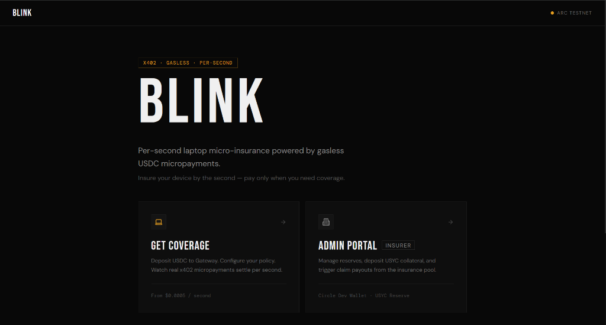
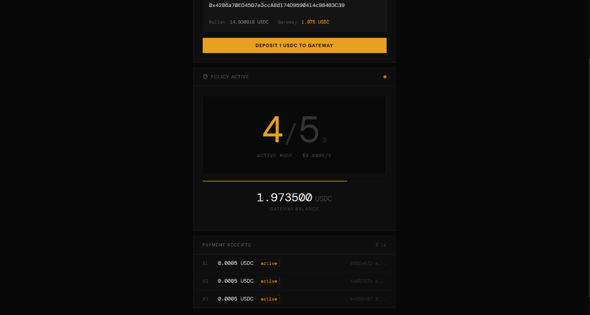
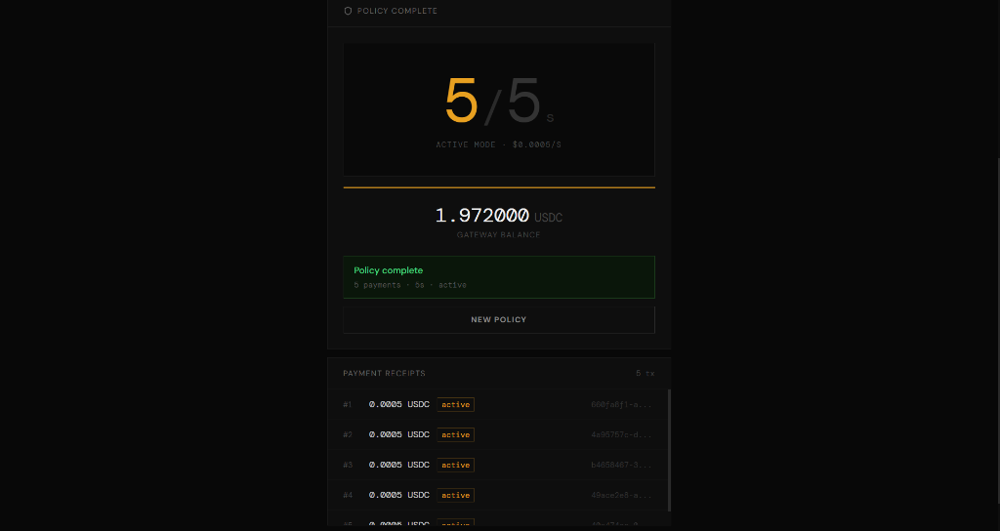
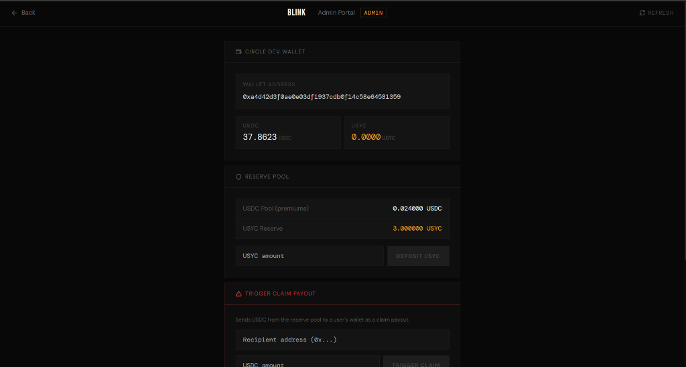

# Blink - Per-Second Laptop Insurance

> Gasless micro-insurance for laptops, paid by the second using x402 on Arc Testnet.

Built for the **Circle Hackathon** · Arc Testnet · x402 Protocol · Circle Developer-Controlled Wallets

---

## What It Does

Blink lets anyone insure their laptop **by the second** - no sign-up, no annual premium, no paperwork. You pay only for the exact seconds you're covered.

| Mode | Rate | Use case |
|------|------|----------|
| **At Desk** | $0.000005 / second | Laptop in use, user present |
| **Away** | $0.00001 / second | Laptop unattended or in transit |

Every second of coverage is a real USDC micropayment over the **x402 protocol** on Arc Testnet. The insurance reserve pool is managed by the admin via **Circle Developer-Controlled Wallets**.

---


## Screenshots

<div align="center">
  
</div>

<div align="center">
  
  
</div>
<div align="center">
  <em>Real-time 5-second streaming policy via x402 gateway</em>
</div>
<br />

<div align="center">
  
  <p><em>Admin Portal - Staking USYC reserves and managing claims via Circle Developer Wallets</em></p>
</div>

---

## How It Works

```
User                          Backend (x402)             Circle Dev Wallet
 │                                 │                            │
 ├── deposit USDC to gateway ─────►│                            │
 │                                 │                            │
 ├── start policy (5s at desk) ───►│                            │
 │   ┌─ per-second payment loop ──►│                            │
 │   │  $0.000005 x402 payment/sec  │ verifies + settles         │
 │   └─ repeat for N seconds       │                            │
 │                                 │                            │
 └── policy complete               │                            │
                                   │                            │
Admin                              │                            │
 ├── deposit & stake USYC reserve ──────────────────────────────►│
 └── trigger claim payout ─────────────────────────────────────►│ USDC → user
```

1. **User** deposits USDC into their x402 Gateway wallet
2. They select a mode (At Desk / Away), set a duration, and click **Start Policy**
3. Every second, the frontend fires a paid request to the backend - each request is a self-contained x402 micropayment
4. **Admin** deposits USYC into the reserve pool (which they have the ability to stake) and triggers USDC claim payouts for verified losses

---

## Stack

| Layer | Tech |
|-------|------|
| Frontend | React 18 + Vite + TypeScript + Tailwind CSS |
| Micropayments | x402 protocol via `@circlefin/x402-batching` |
| Backend | Node.js + Express |
| Reserve wallets | Circle Developer-Controlled Wallets |
| Network | Arc Testnet (EVM, chainId `5042002`) |
| Tokens | USDC (`0x360...`) · USYC (`0xe91...`) |

---

## Demo

### Prerequisites

- Node.js 18+
- `backend/.env` configured (copy from `.env.example`)

### 1. Start the backend

```bash
cd backend
npm install
node server.js
# → http://localhost:3001
```

### 2. Start the frontend

```bash
cd frontend
npm install
npm run dev
# → http://localhost:5173 (or next available port)
```

### 3. Demo flow

1. Open the app → click **User Portal**
2. Click **Deposit 1 USDC to Gateway** to fund your gateway wallet
3. Set duration (e.g. 5 seconds), choose At Desk or Away mode
4. Click **Start Policy** - watch per-second payments stream in real time with live balance updates
5. Copy your buyer address, switch to **Admin Portal**, paste into "Trigger Claim Payout" to send USDC back as a claim

---

## API Endpoints

| Method | Path | Auth | Description |
|--------|------|------|-------------|
| `GET` | `/api/health` | - | Service health check |
| `GET` | `/api/status` | - | Contract pool balances |
| `GET` | `/api/insure/active` | x402 $0.000005 | At-desk coverage tick |
| `GET` | `/api/insure/idle` | x402 $0.00001 | Away coverage tick |
| `GET` | `/api/balance/:address` | - | USDC + USYC balance |
| `POST` | `/api/admin/deposit-reserve` | - | Deposit USYC to reserve |
| `POST` | `/api/admin/trigger-claim` | - | Send USDC claim to user |

---

## Environment Variables

```env
# backend/.env
PORT=3001
ARC_RPC_URL=https://rpc.testnet.arc.network
BLINKRESERVE_ADDRESS=<deployed contract>

CIRCLE_API_KEY=<your key>
CIRCLE_ENTITY_SECRET=<your secret>
CIRCLE_WALLET_ID=<wallet id>
CIRCLE_WALLET_ADDRESS=<wallet address>
```

---

## Project Structure

```
BlinkReserve-Hedera/
├── backend/
│   └── server.js                        # Express + x402 gateway middleware
├── frontend/
│   └── src/
│       ├── InsuracleDashboard.tsx        # User portal (buy per-second coverage)
│       ├── InsuracleDashboardAdmin.tsx   # Admin portal (reserves + claims)
│       └── lib/
│           └── gatewayClient.ts          # x402 Gateway client wrapper
├── contracts/                           # Solidity reserve pool
├── scripts/                             # Deployment + funding helpers
└── .env.example
```

---

## License

MIT
